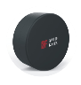
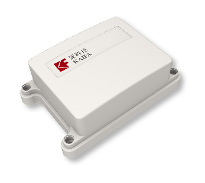
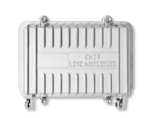
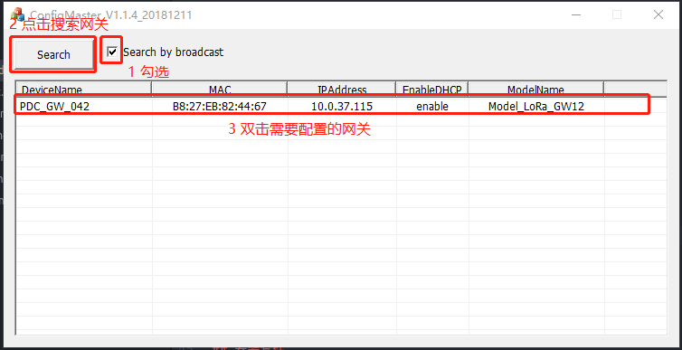
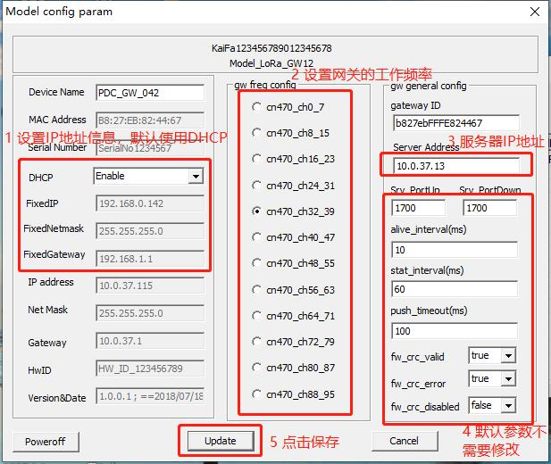

# 购买套件

!!! info "为什么需要{==付费==}购买"

    生产套件要投入一定的成本。

## “套件”什么是

如果您打算进行二次开发，而且需要“硬件”来发送数据至服务器，那么您需要以下的”硬件“：

* 蓝牙定位标签
* 定位微基站
* LoRa网关

蓝牙定位标签  

定位微基站  

LoRa网关  

## 如何购买

您可以[联系我们]()购买和获取技术支持

## 如何配置

### 下载配置软件

将“套件”接入LBS系统，需要一些配置，您需要下载以下的软件，用于配置：

* [ConfigMaster](./assets/ConfigMaster_20181211.zip)

### 学习配置方法

LoRa网关使用ConfigMaster进行配置，配置方法如下：  

  

## 安装套件

完成配置后，套件即可投入使用，套件的安装方法如下：

### 安装视频

[安装视频 (邹苏鹏 提供)]()

## 验证套件

套件投入使用后，开始与服务器通讯，验证套件是否正常工作的方法如下

[验证方法 (刘兴平 提供)]()

感谢使用深科技的产品，欢迎[联系我们](./contact.md)探讨更多的合作！
